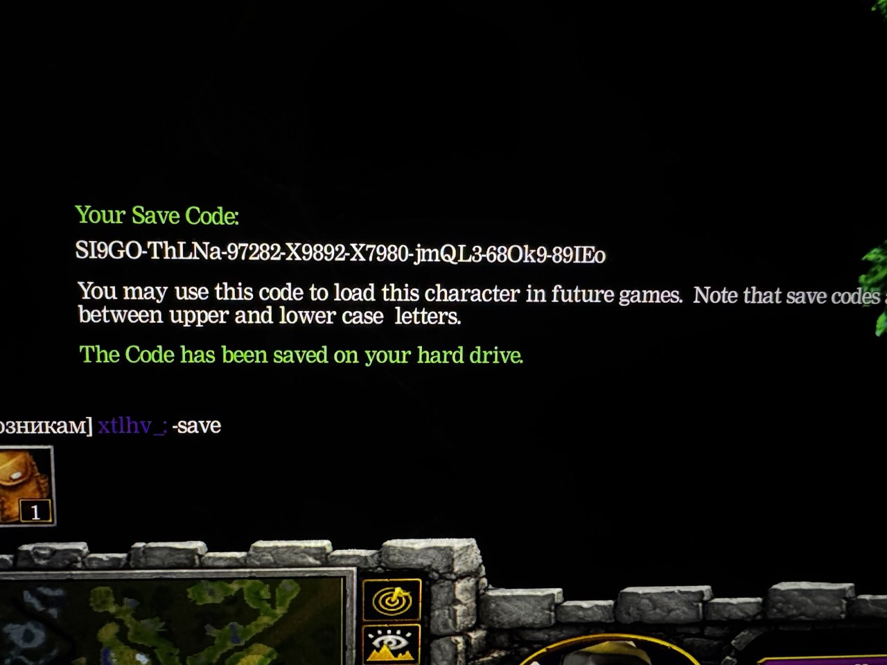
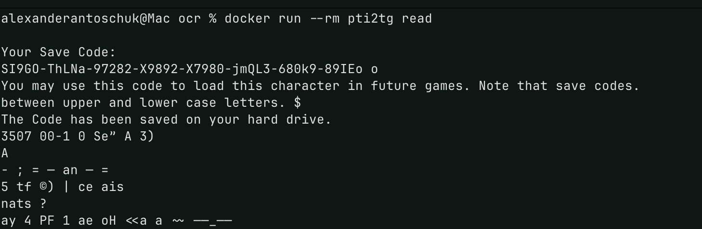

# pti2tg

Parse text from image to plain text (written in Go)

## About

After playing Warcraft III custom maps, 
As some maps don't support saving and loading from a file. 
Since it's not very enjoyable to type codes manually, 
I thought it would be nice to build something that can extract the code from a screenshot so I can just copy and paste it into the game.

## Usage

### Local Installation
Install tesseract. Then build go binary

```
go build .
```

and execute it like 

```
pti2tg read -p <path-to-theimage.png>
```

### Using Docker

Build container:

```
docker build -t pti2tg .
```

run it mounting the image and pass it using flagh `-p`:

```
docker run --rm -v /Users/yourusername/somefolder:/images pti2tg read -p /images/image-name.jpg
```

>**NOTE**: if tesseract is not working or Docker have limited access to the folders ( like on Mac ) 
> you could place image right in the Docker container and hardcode "./image-name.png"
> for that you have `hardcodedPath` variable in `RootCmd` function command.

## List of all commands 

```
h help 
v display the version of pti2tg
read reads text from the image, flag -p allow to provide a custom path to the image
```

You can also use the `-v` or `--version` or

## Flags

```
-h, --help help 
-v, --version display the version of pti2tg
```


ocr: https://github.com/otiai10/gosseract

## Example

Example image with the code:



Result of reading the text from the image above using this tool:



